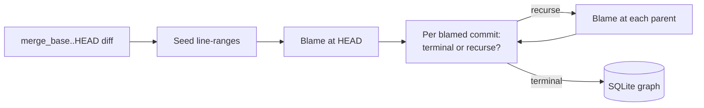

# histoire

A target-first recursive `git blame` tool. `histoire` takes the diff between
your current branch and a base ref, runs blame against the changed lines, and
walks backward through parents — storing every commit, file event, hunk, and
lineage edge in a local SQLite database.

It is an experiment for an AI code-review product: an attempt to capture the
historical context a human reviewer brings to a PR without indexing the entire
repository DAG.

## Build

From the workspace root:

```sh
cargo build -p histoire --release
```

The binary lands at `target/release/histoire`.

## Quick start

```sh
# Default: base = origin/main, depth = 5, since = six months ago,
# db = <git-dir>/histoire.sqlite.
histoire scan

# Explicit base ref (e.g. master-default repos):
histoire scan origin/master

# Tune the walk:
histoire scan origin/main --max-depth 8 --since 2024-01-01 --rename-threshold 40

# Inspect the resulting database:
sqlite3 .git/histoire.sqlite ".schema"
sqlite3 .git/histoire.sqlite "SELECT * FROM scans;"
```

If the base ref does not resolve (e.g. `origin/main` on a `master`-only repo),
`histoire` warns and writes an empty scan rather than failing.

## Subcommands

| Command         | What it does                                                                 |
| --------------- | ---------------------------------------------------------------------------- |
| `scan [base]`   | Drops the DB, computes the seed diff, recursively blames, writes the graph.  |
| `skill`         | Emits a `SKILL.md` describing the schema + ready-made queries for an LLM.    |

### `scan` flags

| Flag                  | Default                       | Notes                                                     |
| --------------------- | ----------------------------- | --------------------------------------------------------- |
| `--db <path>`         | `<git-dir>/histoire.sqlite`   | Output database.                                          |
| `--max-depth <n>`     | `5`                           | Recursion cap (depth of parent expansion).                |
| `--since <yyyy-mm-dd>`| six months ago                | Skip commits older than this.                             |
| `--include-binary`    | off                           | Otherwise binary files are recorded as `binary_skipped`.  |
| `--rename-threshold`  | `50`                          | libgit2 similarity threshold (0–100). Lower = aggressive. |

Logging is controlled via `RUST_LOG`. Default is `histoire=info`; set
`RUST_LOG=histoire=debug` for verbose output, or any standard
[`tracing_subscriber::EnvFilter`](https://docs.rs/tracing-subscriber/latest/tracing_subscriber/filter/struct.EnvFilter.html)
directive.

### `skill` flags

| Flag                  | Default     | Notes                                                |
| --------------------- | ----------- | ---------------------------------------------------- |
| `-o`, `--output`      | `SKILL.md`  | Where to write the skill file.                       |
| `--stdout`            | off         | Print the rendered skill to stdout instead.          |

## How it works



Cutoffs:

- **Depth**: stop after `--max-depth` parent expansions.
- **Age**: stop when the next blamed commit is older than `--since`.
- **Origin**: lines added by a commit with no parent preimage terminate as `introduced_here`.
- **Root**: commits with no parents terminate as `root_commit`.
- **Binary**: skipped unless `--include-binary` is set.

Renames are detected per diff with libgit2's `find_similar` (renames + copies,
configurable threshold) and persisted as `file_events` rows. Blame itself uses
`track_copies_same_file`, so each span's `origin_path` reflects the
post-rename path at the blamed commit.

## Database

Default path: `<git-dir>/histoire.sqlite`. Every `scan` drops and recreates
the file — runs are not cumulative.

For full schema + canned queries, run:

```sh
histoire skill --stdout | less
```

Key tables:

- `scans` — one row per run.
- `commits`, `commit_parents` — discovered commit metadata.
- `file_events`, `diff_hunks` — every delta visited (seed + per-commit).
- `seed_ranges` — the added line-ranges that initiated the scan.
- `blame_requests` — the queue of (commit, path, range, depth) tuples.
- `blame_spans` — clipped blame hunks attributed to ancestor commits.
- `lineage_edges` — `recurse_to_parent` or one of five terminal types.

## V0 status

- Single binary, no library API yet.
- The seed diff (`merge_base..HEAD`) and the per-commit diff (`HEAD^..HEAD`) may
  be persisted twice when the branch is exactly one commit ahead of the merge
  base. Harmless duplication; correctness is unaffected.
- No incremental scans, no remote integration, no UI.
- Tested manually against this workspace. Behaviour is deterministic across
  runs on identical input.
