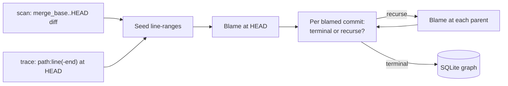

# histoire

A target-first recursive `git blame` tool. `histoire` runs blame against a set
of seed lines and walks backward through parents — storing every commit, file
event, hunk, and lineage edge in a local SQLite database. The seed can be
either the diff between your current branch and a base ref (`scan`) or a
single `path:line(-end)` target at `HEAD` (`trace`).

It is an experiment for an AI code-review product: an attempt to capture the
historical context a human reviewer brings to a PR without indexing the entire
repository DAG.

## Build

From the workspace root:

```sh
cargo build -p histoire --release
```

The binary lands at `target/release/histoire`.

## Quick start

```sh
# scan — seed from merge_base..HEAD.
# Defaults: base = origin/main, depth = 5, since = six months ago,
# db = <git-dir>/histoire.sqlite.
histoire scan
histoire scan origin/master                              # explicit base
histoire scan origin/main --max-depth 8 --since 2024-01-01 --rename-threshold 40

# trace — seed from a single path:line(-end) target at HEAD.
# Defaults: depth = 20, since = twelve months ago.
histoire trace src/main.rs:300
histoire trace src/main.rs:300-320
histoire trace src/main.rs:300 --max-depth 40 --since 2023-01-01

# Inspect the resulting database:
sqlite3 .git/histoire.sqlite ".schema"
sqlite3 .git/histoire.sqlite "SELECT * FROM scans;"
```

If the base ref does not resolve (e.g. `origin/main` on a `master`-only repo),
`histoire scan` warns and writes an empty scan rather than failing.

## Subcommands

| Command                | What it does                                                                          |
| ---------------------- | ------------------------------------------------------------------------------------- |
| `scan [base]`          | Drops the DB, computes the merge-base diff, recursively blames, writes the graph.     |
| `trace <path:line[-end]>` | Drops the DB, seeds blame from a single line/range at HEAD, recursively walks back. |
| `skill`                | Emits a `SKILL.md` describing the schema + ready-made queries for an LLM.             |

### `scan` flags

| Flag                  | Default                       | Notes                                                     |
| --------------------- | ----------------------------- | --------------------------------------------------------- |
| `--db <path>`         | `<git-dir>/histoire.sqlite`   | Output database.                                          |
| `--max-depth <n>`     | `5`                           | Recursion cap (depth of parent expansion).                |
| `--since <yyyy-mm-dd>`| six months ago                | Skip commits older than this.                             |
| `--include-binary`    | off                           | Otherwise binary files are recorded as `binary_skipped`.  |
| `--rename-threshold`  | `50`                          | libgit2 similarity threshold (0–100). Lower = aggressive. |

### `trace` flags

| Flag                  | Default                       | Notes                                                     |
| --------------------- | ----------------------------- | --------------------------------------------------------- |
| `--db <path>`         | `<git-dir>/histoire.sqlite`   | Output database.                                          |
| `--max-depth <n>`     | `20`                          | Recursion cap (deeper than `scan` — one target, more rope).|
| `--since <yyyy-mm-dd>`| twelve months ago             | Skip commits older than this.                             |
| `--include-binary`    | off                           | Otherwise binary files are recorded as `binary_skipped`.  |
| `--rename-threshold`  | `50`                          | libgit2 similarity threshold (0–100). Lower = aggressive. |

The target argument is `path:line` for a single line or `path:start-end` for an inclusive line range. Paths are taken verbatim — relative to the worktree root, the same convention `git blame` uses.

Logging is controlled via `RUST_LOG`. Default is `histoire=info`; set
`RUST_LOG=histoire=debug` for verbose output, or any standard
[`tracing_subscriber::EnvFilter`](https://docs.rs/tracing-subscriber/latest/tracing_subscriber/filter/struct.EnvFilter.html)
directive.

### `skill` flags

| Flag                  | Default     | Notes                                                |
| --------------------- | ----------- | ---------------------------------------------------- |
| `-o`, `--output`      | `SKILL.md`  | Where to write the skill file.                       |
| `--stdout`            | off         | Print the rendered skill to stdout instead.          |

## How it works

Both subcommands share the same recursion machinery — only the seed differs:



Cutoffs:

- **Depth**: stop after `--max-depth` parent expansions.
- **Age**: stop when the next blamed commit is older than `--since`.
- **Origin**: lines added by a commit with no parent preimage terminate as `introduced_here`.
- **Root**: commits with no parents terminate as `root_commit`.
- **Binary**: skipped unless `--include-binary` is set.

Renames are detected per diff with libgit2's `find_similar` (renames + copies,
configurable threshold) and persisted as `file_events` rows. Blame itself uses
`track_copies_same_file`, so each span's `origin_path` reflects the
post-rename path at the blamed commit.

## Database

Default path: `<git-dir>/histoire.sqlite`. Every run of `scan` or `trace`
drops and recreates the file — runs are not cumulative. A `trace` database
is distinguishable from a `scan` database by `scans.base_ref`, which is
prefixed with `trace:` (and where `base_sha == merge_base_sha == head_sha`).

For full schema + canned queries, run:

```sh
histoire skill --stdout | less
```

Key tables:

- `scans` — one row per run.
- `commits`, `commit_parents` — discovered commit metadata.
- `file_events`, `diff_hunks` — every delta visited (seed + per-commit).
  Empty for a `trace` run until recursion fans out into a commit's parent diff.
- `seed_ranges` — the line-ranges that initiated the run. One per added
  range in `scan` mode; a single row carrying the target in `trace` mode.
- `blame_requests` — the queue of (commit, path, range, depth) tuples.
- `blame_spans` — clipped blame hunks attributed to ancestor commits.
- `lineage_edges` — `recurse_to_parent` or one of five terminal types.

## V0 status

- Single binary, no library API yet.
- In `scan` mode, the seed diff (`merge_base..HEAD`) and the per-commit
  diff (`HEAD^..HEAD`) may be persisted twice when the branch is exactly
  one commit ahead of the merge base. Harmless duplication; correctness
  is unaffected. `trace` mode is unaffected.
- No incremental scans, no remote integration, no UI.
- Tested manually against this workspace. Behaviour is deterministic across
  runs on identical input.
